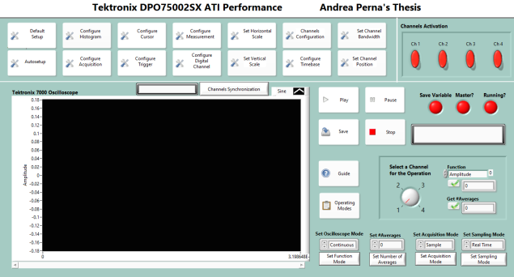
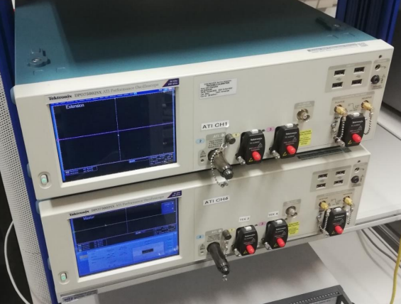
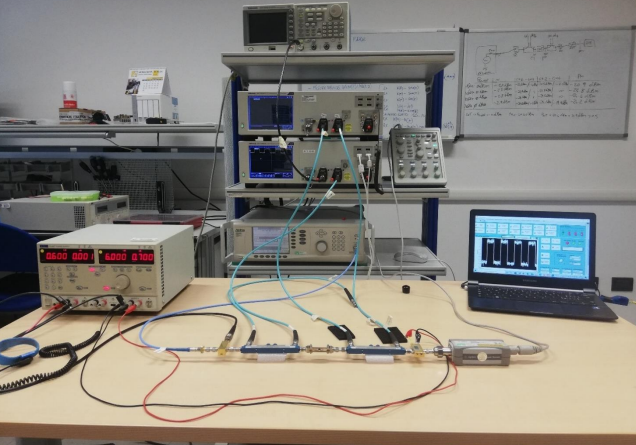

#  Remote Control Software for a Digital Microwave Oscilloscope

[](https://www.ni.com/en-us/shop/labview.html)  
LabVIEW-based remote interface for waveform acquisition, configuration, real-time analysis, and automated logging on Tektronix digital oscilloscopes.

---

## 📌 Project Info
- 🎓 Course: Sistemi Elettronici di Misura
- 🏫 University of Ferrara
- 📅 Year: 2021/2022
  
---

## 🧠 About the Project

This project focuses on the development of a **remote control software** for the **Tektronix DPO75002SX ATI Performance Oscilloscope** series, using **LabVIEW** and **VISA protocol**.

Designed during my Bachelor's Thesis at the University of Bologna (2021), it enables:

- Full remote configuration of oscilloscope parameters (vertical, horizontal, triggering)
- Real-time acquisition and multi-channel waveform processing
- Logging of signal data and acquisition setup for post-processing
- Error-controlled, modular, and scalable software architecture

The software addresses the need for **automated RF and microwave measurements** without manual intervention, especially in **characterization setups**.

---

## 🗂 Project Structure

```
📦 oscilloscope-remote-control/
├ 📁 DPO70K/                             # Tektronix Instrument Drivers
├ 📁 File_Salvataggio/                   # Saved measurement files
├ 📁 Istantanee_Schermo/                 # Screenshots and waveform captures
├ 📁 Immagini/                           # System overview and setup photos
│  ├ 📸 Interfaccia.png                  # LabVIEW front panel interface
│  ├ 📸 Oscilloscopio.png                # Tektronix Oscilloscope
│  ├ 📸 Setup.png                        # Full testbench setup
│  └ 📸 Visualizzazione.png              # Waveform visualization
├ 📁 subVI/                              # Modular reusable LabVIEW subVIs
├ 📁 Tektronix 7000 Series/              # Communication libraries
├ 💻 MyMenu.rtm                          # Custom Run-Time Menu for interface control
├ 💻 Oscilloscope_Interface.vi           # Main software application
├ 📘 Tesi_Andrea_Perna.pdf               # Bachelor Thesis Document
└ 📄 README.md                           # You are here!
```

---

## 📷 Overview

<p align="center">
  
  
</p>

<p align="center">
  
  
</p>

- **Interfaccia**: Custom LabVIEW control panel for managing the oscilloscope remotely.
- **Oscilloscopio**: High-performance Tektronix DPO75002SX system used for testing.
- **Setup**: Complete experimental bench layout for DUT characterization.
- **Visualizzazione**: Example of acquired RF waveforms using the developed system.

---

## ⚙️ Main Features

### 🛠 Remote Configuration & Control

- Horizontal Scale, Position, Sample Rate
- Vertical Sensitivity and Offset for multiple channels
- Trigger Setup (Level, Edge, Slope, Coupling)
- Cursors for Voltage/Time Analysis

### 📡 Waveform Acquisition

- Real-time reading of waveforms on up to 4 independent channels
- Adjustable acquisition depth and record length
- Selectable data formats (ASCII, Binary) for optimized speed/size

### 📝 Data Logging and Export

- Saved data includes:
  - Timestamp
  - Oscilloscope settings
  - Waveform points (X, Y coordinates)
- Structured `.txt` files for immediate MATLAB/Python/Excel analysis

### 🔄 Software Architecture

- **Event-driven** design
- **SubVI modularization** for:
  - VISA Open/Read/Close operations
  - Waveform parsing
  - Channel configuration
  - Screen captures
- Robust **Error Handling** and **Reset** functionalities

---

## 📊 Experimental Validation and Application

The developed software was validated through the **RF characterization** of a **GaAs power transistor**:

- **Testbench Setup**:
  - RF Signal Generator → DUT (GaAs Amplifier) → DPO Oscilloscope
  - Bi-directional couplers, bias-T, RF attenuators

- **Measurements Performed**:
  - **Gain Compression (P1dB)**: dynamic tracking via automated sweeps
  - **Output Power** vs Input Drive
  - **Efficiency** vs Output Level

- **Results Achieved**:
  - Successful real-time acquisition over long measurement campaigns
  - Reliable remote control during sweep experiments
  - Confirmed robustness for both **steady-state** and **transient** waveforms

---

## 🛠 Technologies Used

- **LabVIEW 2020** Development System
- **NI VISA Library** for direct instrument communication (GPIB, Ethernet)
- **Tektronix OpenChoice API** support
- **Custom SubVIs** for repetitive operations
- **Structured File Management** for experiments

---

## 🎥 Output Visualization

Screenshots of the remote control panel, acquisition settings, and waveforms are available inside `/Istantanee_Schermo/`.  
Data and results from full measurement sessions are stored inside `/File_Salvataggio/`.

---

## 👨‍🎓 Author

Bachelor's Thesis, B.Sc. in Electronic Engineering – University of Bologna (2021)  
- Andrea Perna

📧 and.perna99@gmail.com

---

## 👩‍🏫 Supervisors

- Prof.ssa Valeria Vadalà
- Dr. Ing. Gianni Bosi

---

## 📎 Resources

- [📘 Complete Bachelor Thesis (Tesi_Andrea_Perna.pdf)](./Tesi_Andrea_Perna.pdf)
- 📚 LabVIEW 2020 Professional Documentation
- 📚 Tektronix DPO70000SX Series Manuals
- 📚 NI VISA API Reference

---

## 📜 License

All rights reserved. Educational use only.

---
